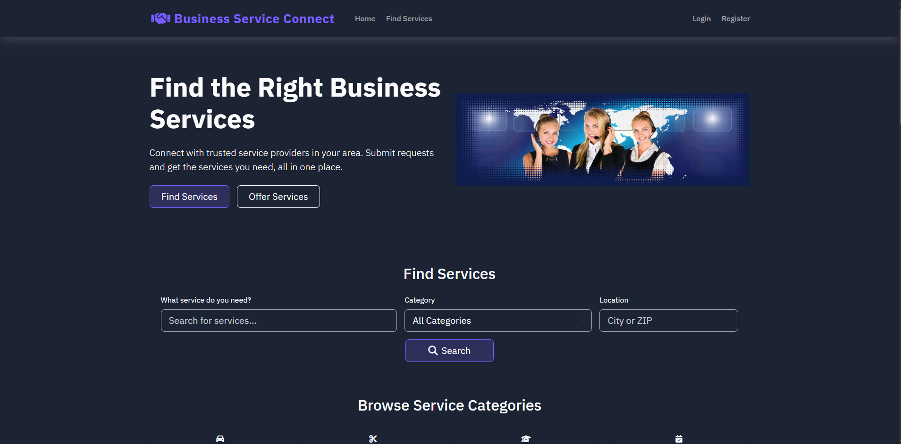

# Business-Service-Connect

Business-Service-Connect is a modern web platform that connects **small business service providers** with **people who need their services**.  
It aims to support local businesses by creating a simple marketplace where users can **post service requests**, and providers can **respond, advertise, and accept jobs**.

Built using:

- **PHP**
- **JavaScript**
- **HTML**
- **TailwindCSS CDN**
- **MySQL**

---

## Badges

---

# Table of Contents

- [About the Project](#about-the-project)  
- [Key Features](#key-features)  
- [Technology Stack](#technology-stack)  
- [Author](#author)  

---

# About the Project

Business-Service-Connect provides a streamlined way for:

### 🎯 Service Requestors  
- Post what they need  
- Search available providers  
- View provider information  
- Track service requests  

### ⚙️ Service Providers  
- Create a professional provider profile  
- Showcase skills, pricing, and work hours  
- Receive and accept service requests  
- Manage completed jobs  

---

# Key Features

- 🧾 **Service Request Posting**  
- 🔍 **Search + Filter Providers**  
- 🧑‍🔧 **Provider Profiles**  
- 🔐 **Secure Login & Registration (PHP + PDO)**  
- 📱 **Responsive UI with TailwindCSS**  
- ⚡ **Fast AJAX interactions (Vanilla JS)**  
- 💾 **MySQL database with relational models**  
- 📤 **REST-like PHP API structure**  

---

# Technology Stack

| Layer        | Technology |
|-------------|------------|
| Frontend    | HTML, TailwindCSS (CDN), JavaScript |
| Backend     | PHP 8+ |
| Database    | MySQL |
| Architecture| REST-like API |
| Tools       | XAMPP, phpMyAdmin |

---

# Author

**Nethononda Nyandano**  
Full-Stack Developer | PHP • JavaScript • Tailwind • MySQL  

- **GitHub:** https://github.com/Nethononda-Nyandano  
- **Email:** nyandanonethononda8@gmail.com  
- **Location:** South Africa  

---

